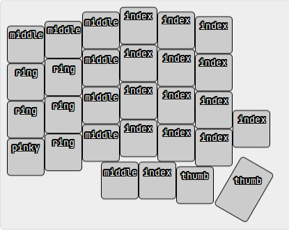
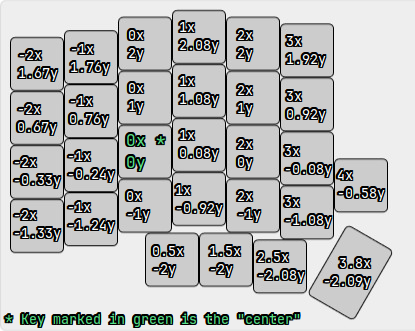
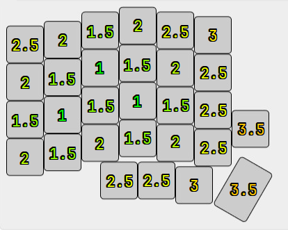

## Implementation (Copied from README)
By default, the engine finds the best layout for my own left-hand only Lily58 to map 26 keys to the English alphabet. I have restricted the thumb to two keys only for Space and Enter and the pinky to one key only for Backspace. This means that **the engine assigns only the Ring, Middle and Index fingers to these 26 keys, and while you can choose another set of keys and which finger presses what key, you cannot assign the pinky or thumb to any key -- the engine doesn't know about them.**

## Default finger assignments

You'll notice almost immediately that the index finger is responsible for half the keyboard: 14 keys. My goal with the left-hand only Lily58 has always been to stop moving my right hand back and forth between a regular keyboard and mouse. I want my left hand always on the keyboard and my right hand always on the mouse, deliberately sacrificing typing speed for flow. Some English letters are very frequent when typing while others are scarce, and the engine takes advantage of that to push the less frequent characters like ``Z`` or ``Q`` away to the right-side edge, keeping the index finger comfortable.

## Key Distances from the Center
These are the measurements I've made on an actual Lily58:

The unit of measurement is the distance between the centers of two adjacent keys. The Lily58 follows the standard unit for keyboards ``1u = 19.05mm``.\
These measurements are used to penalize stretches, like stretching the ring finger to the left then the index to the right, creating an uncomfortable hand position.

## Gravitation towards the Center
A flat penalty (or weight) is applied to every key pressed, and that penalty increases the further away it is from the center of the keyboard:

This will make the Simulated Annealing (SA) algorithm naturally gravitate towards the center. The center is technically the key on the 3rd row, 3rd column, but pulled slightly upward to align with the fingers' natural "resting" position.\
You may wonder why I didn't just use the euclidean distances for this. It's because these distances can't capture the "feel" of your hand on each key, and I decoupled the logic of weights from distance for you to be able to easily change them to your liking.
